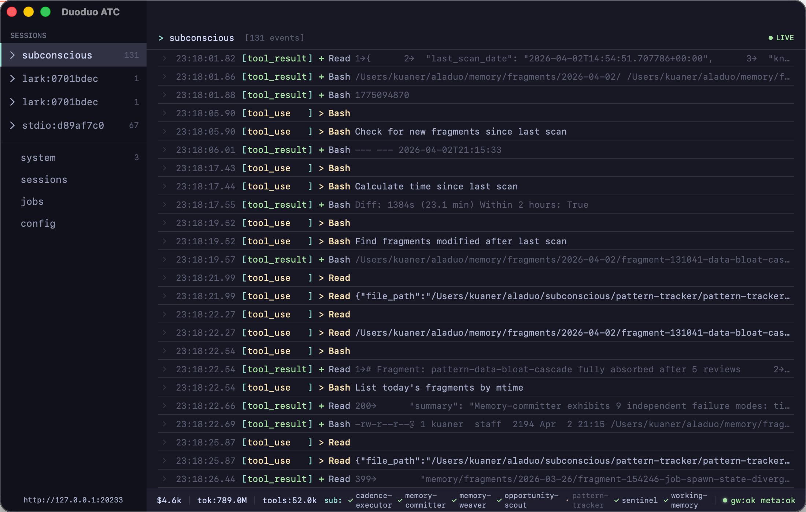

# DuoduoManager

A macOS menu bar application for managing the [duoduo](https://github.com/openduo/duoduo) daemon and its channels (e.g., Feishu/Lark). Built with SwiftUI for macOS 14+.

## Features

- **Menu bar interface** — Unobtrusive status item with a popover for quick access to daemon controls, channel status, and version updates
- **Flexible runtime options** — Choose bundled Node.js builds or a universal-lite build that uses system Node.js
- **Daemon management** — Start, stop, restart, and configure the duoduo daemon directly from the popover
- **Channel management** — Install, configure, and control messaging channels (currently Feishu)
- **Smart upgrades** — Version-aware: only updates and restarts components with newer versions
- **ATC Dashboard** — Real-time event stream, session monitoring, and job management in a native panel (Catppuccin Mocha theme)
- **CC Reader** — Embedded [cc-reader](https://github.com/kuaner/cc-reader) for browsing Claude Code session history, with timeline rendering, syntax highlighting, and multi-pane layout

## Screenshots

### Menu Bar Popover

Quick access to daemon status, channel controls, and one-click actions. The footer provides shortcuts to open ATC Dashboard, CC Reader, or quit the app.


### ATC Dashboard

Real-time event stream, active sessions, and job queue. Built with a Catppuccin Mocha dark theme for comfortable monitoring.



### CC Reader

Browse and search Claude Code conversation history with markdown rendering, syntax highlighting, and session management. Toolbar items (working directory, resume, refresh) are integrated into the title bar.


## Installation

### Download

Download the DMG for your architecture from [Releases](https://github.com/openduo/duoduo-manager/releases):

- `DuoduoManager-*-arm64-with-nodejs.dmg` — Apple Silicon (bundled Node.js, no extra setup)
- `DuoduoManager-*-x86_64-with-nodejs.dmg` — Intel (bundled Node.js, no extra setup)
- `DuoduoManager-*-universal-lite.dmg` — Universal binary, uses system Node.js (Node.js 22+ required)

### From source

```bash
git clone https://github.com/openduo/duoduo-manager.git
cd duoduo-manager
make run        # Build and launch for development
make app        # Build arm64 + x86_64 .app bundles
```

### Prerequisites

- macOS 14 (Sonoma) or later
- Xcode Command Line Tools (`xcode-select --install`)

For `*-with-nodejs` builds, no extra runtime setup is required.
For `*-universal-lite` builds, install Node.js 22+ on your system.

## Development

### Build

```bash
make build      # Debug build
make run        # Build and run
make run-release # Build release and run
make clean      # Clean build artifacts
```

### Release

```bash
make app        # Build 3 .app bundles: arm64/x86_64 with-nodejs + universal-lite
make dmg        # Create 3 DMGs with unified naming
make release    # Full release: build + sign + notarize + DMG
```

### Version management

```bash
make version                    # Show current version
make update-version NEW_VERSION=x.y.z
```

## Architecture

See [ARCHITECTURE.md](ARCHITECTURE.md) for detailed architecture documentation including runtime environment, daemon lifecycle, and upgrade flow.

## Localization

See [I18N.md](I18N.md) for how to add or modify translations.

## License

MIT
